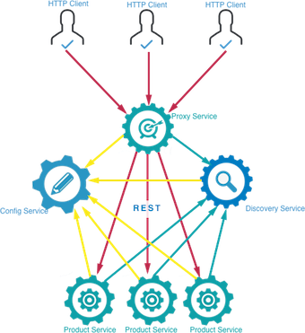
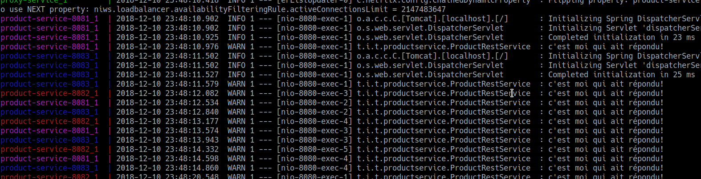
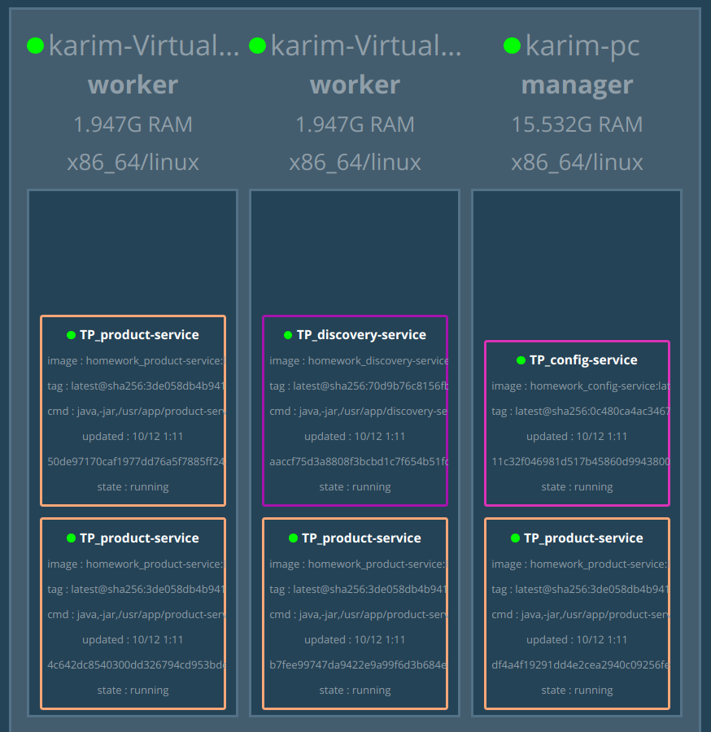
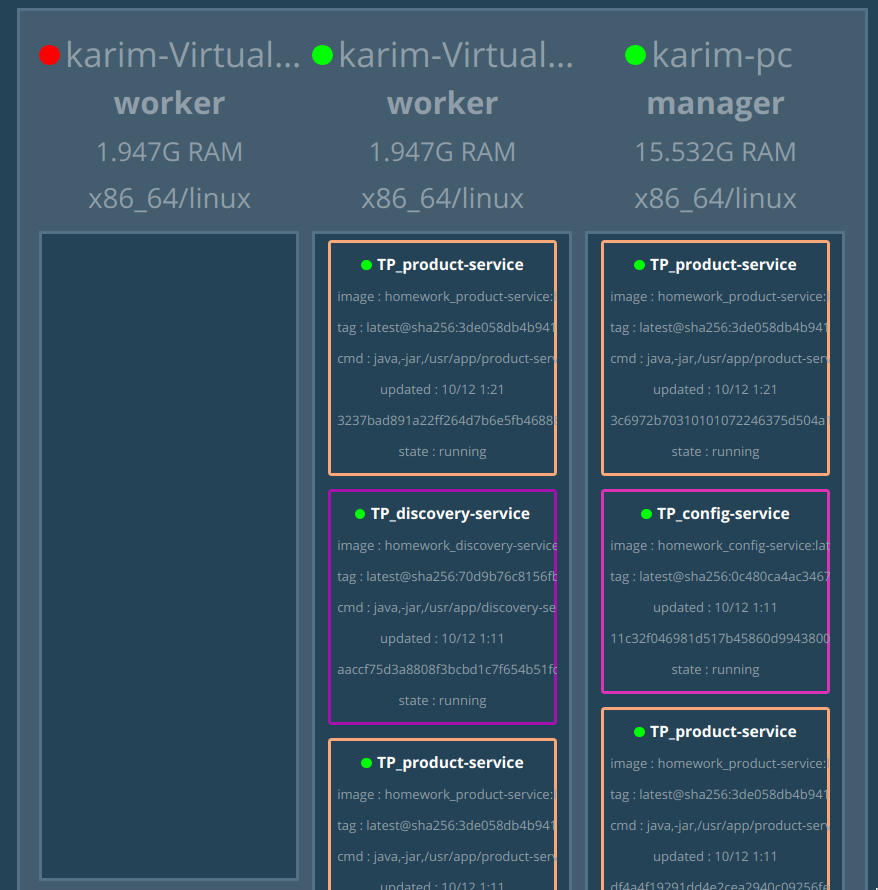

 
# Homework TP4


## Getting started

Download [Docker Desktop](https://www.docker.com/products/docker-desktop) for Mac or Windows. [Docker Compose](https://docs.docker.com/compose) will be automatically installed. On Linux, make sure you have the latest version of [Compose](https://docs.docker.com/compose/install/).


## Architecture 


## Dockerizing the App
 1. In each project create a spring profile for Docker environment
 2. Create a Docker file that uses [multi-stage builds](https://hub.docker.com/u/karimsaieh/) for each service
 3. Create docker-compose file that uses [wait-for-it.sh](https://github.com/vishnubob/wait-for-it) script to synchronise dependent services
 4. building and running the containers
	```
	docker-compose -f docker-compose.dev.yml up
	```
	> building all the images may take a while, so instead you can use built images that i already pushed to [Docker hub](https://hub.docker.com/u/karimsaieh/) by running  `docker compose up`

- Eureka  will be running at [http://localhost:8761](http://localhost:8761),
- config service will be running at [http://localhost:8888](http://localhost:8888),
- proxy service  will be running at [http://localhost:9999](http://localhost:9999),
- product service will be running at [http://localhost:8080](http://localhost:8080),
 [http://localhost:8081](http://localhost:8081) && [http://localhost:8082](http://localhost:8082),

## Run on Docker Swarm
Alternately, if you want to run it on [Docker Swarm](https://docs.docker.com/engine/swarm/),  first make sure you have a swarm. If you don't, run:
```
docker swarm init
```
Once you have your swarm, in this directory run:
```
docker stack deploy -c docker-compose-stack.yml TP
```
To visualize the swarm run 
```
docker run -it -d -p 5000:8080 -v /var/run/docker.sock:/var/run/docker.sock dockersamples/visualizer
```


if you want to access any service, just type 
```<Any Node Ip In The Cluster>/Port```, Docker swarm will take care of routing and the load balancing


to scale a service use 
```docker service scale any_servicee=<INT>```

if a node fails Docker swarm will reschedule missing containers on other available nodes



